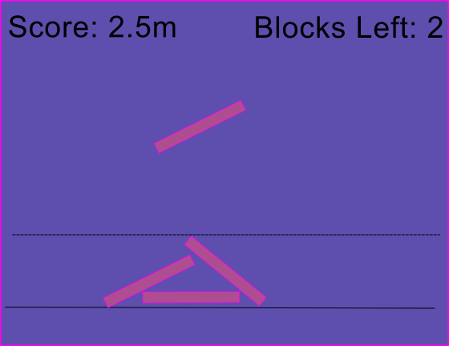

# Card Stacking

Author: Aren Davey

Design: Carefully balance falling cards to stack as much as you can to obtain the highest score possible.

Screen Shot:

How To Play:

AD to move the block, WS to rotate. 

## Extra Credit

Are your Physics Deterministic? If so, how can we verify this?

Are your Physics Rewindable? If so, how can we verify this?

This game was built with [NEST](NEST.md).
